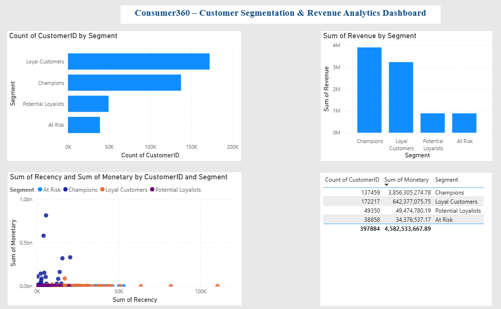

# Consumer360 – Customer Segmentation & CLV Engine

## 📌 Project Overview
Consumer360 is a retail analytics project focused on customer segmentation and business insights using transactional retail data. The project uses RFM (Recency, Frequency, Monetary) analysis, Customer Lifetime Value (CLV), Market Basket Analysis, and Cohort Analysis to identify customer behavior patterns and improve business decision-making.

The project also includes an automated analytics pipeline and an interactive Power BI dashboard for visualization.

---

## 🎯 Objectives
- Identify high-value customers (“Champions”)
- Detect churn-risk customers (“At Risk”)
- Analyze customer purchasing behavior
- Generate business insights for targeted marketing
- Build an automated analytics workflow

---

## 🗂️ Dataset
- Online Retail Transaction Dataset
- Each row represents a product purchased in a transaction

### Main Columns
- InvoiceNo
- StockCode
- Description
- Quantity
- InvoiceDate
- UnitPrice
- CustomerID
- Country

### Dataset File
```text
data/raw/Retail.csv
```

---

## ⚙️ Tech Stack
- Python (Pandas, NumPy, MLxtend)
- SQL
- Power BI
- Git & GitHub

---

# 📊 Project Workflow

## 🔹 Week 1 – Data Engineering
- Explored and inspected dataset
- Removed null CustomerID values
- Removed invalid/negative transactions
- Created Revenue column
- Converted InvoiceDate into datetime format
- Designed SQL schema and optimization queries

---

## 🔹 Week 2 – Customer Segmentation (RFM Analysis)
Calculated:
- Recency
- Frequency
- Monetary values

Implemented:
- RFM scoring
- Customer segmentation
- CLV calculation
- Validation checks
- Automated data pipeline

### Customer Segments
- Champions
- Loyal Customers
- Potential Loyalists
- At Risk

### Output Files
```text
data/processed/rfm_output.csv
week2_analysis/data_pipeline/cleaned_data.csv
```

---

## 🔹 Week 3 – Power BI Dashboard
Created an interactive dashboard with:
- Customer segmentation analysis
- Revenue insights
- Customer distribution
- KPI cards
- RFM visualizations

### Dashboard Preview



---

## 🔹 Week 4 – Advanced Analytics
### Market Basket Analysis
- Applied Apriori Algorithm
- Generated association rules
- Identified products frequently purchased together

### Cohort Analysis
- Analyzed customer retention behavior
- Grouped customers based on first purchase month

### Automation Pipeline
Integrated:
- Data Cleaning
- RFM Analysis
- Market Basket Analysis
- Cohort Analysis

Run full pipeline using:
```bash
python week4_advanced_analytics/automation/run_pipeline.py
```

---

# 📈 Key Insights
- Champions are high-value repeat customers
- At Risk customers indicate possible churn
- Segmentation improves targeted marketing
- Market Basket Analysis helps product recommendations
- Cohort Analysis helps understand customer retention

---

# 📁 Project Structure

```text
consumer360/

├── data/
│   ├── raw/
│   │   └── Retail.csv
│   └── processed/

├── week1_data_engineering/
│   ├── data_cleaning/
│   ├── data_inspection/
│   ├── data_transformation/
│   ├── performance_optimization/
│   └── star_schema_design/

├── week2_analysis/
│   ├── data_pipeline/
│   ├── rfm_analysis/
│   ├── segmentation/
│   └── validation/

├── week3_dashboard/
│   ├── data_preparation/
│   ├── powerbi/
│   └── visuals/

├── week4_advanced_analytics/
│   ├── market_basket/
│   ├── cohort_analysis/
│   └── automation/

├── requirements.txt
└── README.md
```

---

# ▶️ Run Full Project

```bash
python week4_advanced_analytics/automation/run_pipeline.py
```

---